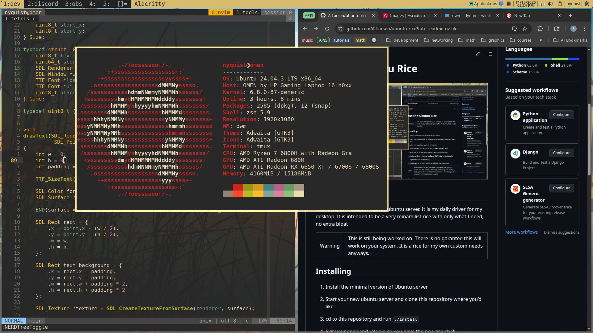

= Austin's Ubuntu Rice

== 📝 Description

This is my own custom rice for ubuntu server. It is my daily driver for my
desktop. It is intended to be a very minamilist rice with only what I need, no
extra bloat.

WARNING: This is still being worked on. There is no garantee this will work on
         your system. It is a rice for my own custom needs anyways.

== ⬇️ Installing
1. Install the minimal version of Ubuntu server
2. Start your new ubuntu server and clone this repository where you'd like
4. `cd` to this repository and run `./install`
5. Exit your shell and relogin so you have the new zsh shell
6. Run `startx` to start your graphical environment (dwm)
7. (optional) Once in dwm press *Super-Shift-Enter* to start alacritty
8. (optional) `cd` to this repository
9. (optional) run `./after-startx` and follow the instructions

NOTE: You may have to edit the config variables in the _install_ script. You
      should find it at the top of the script. For example, if you you want to
      install a different version of vulkan you can change the `VULKANVERSION`
      variable.

== 🤔 How to use
Check out this https://dwm.suckless.org/tutorial/[tutorial]. Everything should
be the same, the only difference being that I changed `ALT` to be `Super`
(windows key). I also added patches from the dwm site and did some of my own custom
changes to the source code.

Patches added to dwm (that I can remember):

* https://dwm.suckless.org/patches/mmnametags/[mmnametags]
* https://dwm.suckless.org/patches/movestack/[movestack]
* https://dwm.suckless.org/patches/xfce4-panel/[xfce4pannel]
* https://dwm.suckless.org/patches/gaps/[gaps]

Extra keyboard shortcuts:

[%header,cols="1,1"]
|===
| shortcut       | operation
| Super+Ctrl+s   | flameshot screenshot
| Super+n        | name the current tag
|===

I would also like to give a special acknowledgement to the
https://dwm.suckless.org/patches/nametag/[nametag] patch. My
https://dwm.suckless.org/patches/mmnametags/[mmnametags] patch is
just some changes and additions to this patch.

== 🧐 Q and A

=== Why Ubuntu?
Even though I have used other minimal distrobutions such as Gentoo and Arch
Linux, I still perfer Ubuntu. Why, you ask? That is because it has a large
support for many pacakges. You don't have to worry whether or not you're
distrobution has any support for the software you need to install. Yes,
compiling from source is cool, but it also takes year off your life and you
might end up compiling all day rather than doing what you were supposed to be
doing in the first place.

=== Why Ubuntu Server?
It is more minimal than Ubuntu desktop and I do not need all of the extra things
Ubuntu desktop includes, such as gnome applications.

=== Why aren't the shell scripts optimized?
I know, I could have wrote my shell scripts in a way that would be more optimal.
I could have also made the whole process a bit better. But, this is a work in
progress. Currently I am just trying to make sure the rice even installs
correctly. Once I know that everything is working well then I'll optimize my
shell scripts and processes. Like, doing things such as removing some unneeded
repetition and some uneeded or excessive files.

=== Why not use windows?
Windows is great for some things, but is not very customizable or good for
developing lower level applications. Linux gives you more control and ease when
working with development tools. Not to mention that you can create windows
applications in linux 😛.

== 👀 Other (unnecessary addition)
I'm using emoji's in my readme to make this look more appealing 💯. It's the new
hip thing to do I suppose. LOOK HOW MUCH COOLER MY README LOOKS NOW. LOOK AT IT

